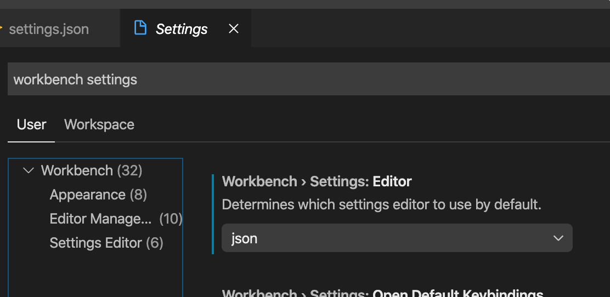
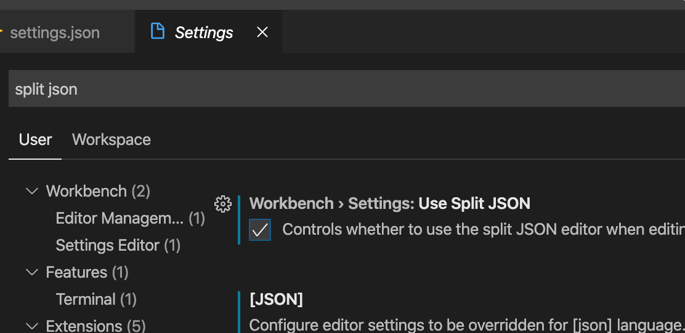
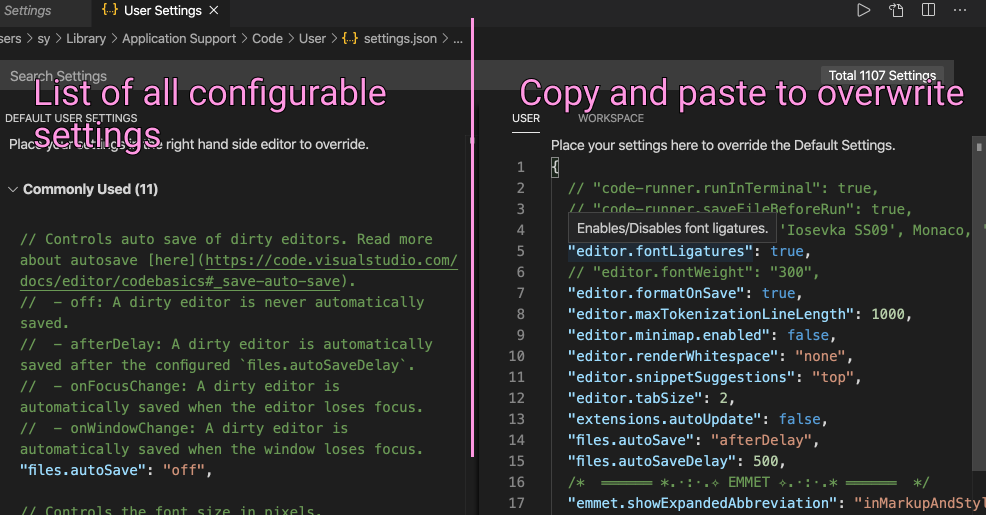

# VS Code Tricks and Tips

This is a bare-bones guide to using your favorite text editor. I hope to bring some tips and tricks that we can all utilize during our LA Cohort 37! If you have suggestions, please make a pull request and I'll try to figure out how to use git. **⚠️ I AM BY NO MEANS AN EXPERT! ⚠️** Everything on this guide is a collection of resources I've accumulated and filtered over the last few weeks.

## Table of Contents

- [My Motivation](#my-motivation)
- [Resources](#resources)
- [👍 Personal Extension List](#---personal-extension-list)
  - [Top 3](#top-3)
  - [Utility](#utility)
  - [UI](#ui)
- [Ok, how do I really set up Airbnb Config?](#ok--how-do-i-really-set-up-airbnb-config-)

## My Motivation

I suffer from moderate RSI that primarily resulted from a shoulder injury two years ago. Long story short, to make learning ~~to code~~ _software engineering_ feasible, I have to go to great lengths to keep my arms relatively pain free. Preparing for Codemsmith, I've fully committed to utilizing and learning as many hotkeys and shortcuts I can in the span of this week. Hopefully, you too will be able to put this resource to good use!

## Links

Microsoft's Visual Studio Code's **[official guide](https://code.visualstudio.com/docs/introvideos/basics)** will always be the canonical source. Stack Overflow and its subdirectory, such as [Super User](https://superuser.com/), have some serious power users in their ranks but they may be as a source too technical and erudite for fledglings like us.

| Links                                                                                                                     | Description                                                      |
| ------------------------------------------------------------------------------------------------------------------------- | :--------------------------------------------------------------- |
| [VS Code settings you should customize](https://dev.to/thegeoffstevens/vs-code-settings-you-should-customize-5e75)        | Miscellaneous setups, including fonts                            |
| [The 25 Best VS Code Extensions](https://medium.com/better-programming/how-to-use-vscode-like-a-pro-e120c428f45f)         | A good number of them are absolutely essential                   |
| [How to Get to the JSON settings in Newer Versions of VS Code](https://stackoverflow.com/a/57960147/13544596)             | Simple stackoverflow answer for User Setting JSON                |
| [VS Code Can Do That?](https://www.vscodecandothat.com/)                                                                  | Advanced videos that I need to check out                         |
| [Windows PDF](https://code.visualstudio.com/shortcuts/keyboard-shortcuts-windows.pdf)                                     | Official PDF of shortcuts                                        |
| [macOS PDF](https://code.visualstudio.com/shortcuts/keyboard-shortcuts-macos.pdf)                                         | PDF                                                              |
| [Linux PDF](https://code.visualstudio.com/shortcuts/keyboard-shortcuts-linux.pdf)                                         | PDF                                                              |
| [Microsoft's Setting up Node JS](https://code.visualstudio.com/docs/nodejs/nodejs-tutorial)                               | Step-by-step setting up terminal, node and running your JS files |
| [Installing VS Code CLI to path](https://code.visualstudio.com/docs/setup/mac)                                            | Making sure to access `code` in your terminal                    |
| [VS Code shortcuts you should know](https://medium.com/swlh/15-visual-studio-code-shortcuts-you-should-know-ea1b4166f69f) | Some good ones you may find useful                               |

## 👍 Personal Extension List

There are too many extensions to list, but I've narrowed down to the absolute essentials, plus a few that I always end up using.

### Top 3

- [ESLint](https://marketplace.visualstudio.com/items?itemName=dbaeumer.vscode-eslint) - Needed for Airbnb config
- [Prettier](https://marketplace.visualstudio.com/items?itemName=esbenp.prettier-vscode) - Format on save 😍
- [Code Runner](https://marketplace.visualstudio.com/items?itemName=formulahendry.code-runner) - press a hotkey to check your code

### Utility

- [Git Lens](https://marketplace.visualstudio.com/items?itemName=eamodio.gitlens) - I haven't touched git, but from the looks of it, it's the industry standard
- [Live Share](https://marketplace.visualstudio.com/items?itemName=MS-vsliveshare.vsliveshare) - for browser rendering
- [Live Server](https://marketplace.visualstudio.com/items?itemName=ritwickdey.LiveServer) - needed for remote programming
- [Quick and Simple Text Selection](https://marketplace.visualstudio.com/items?itemName=dbankier.vscode-quick-select) - powerful ways to select without using the mouse
- [Bracket Select](https://marketplace.visualstudio.com/items?itemName=chunsen.bracket-select) - this does one thing well: select inside brackets

### UI

- [Bracket Colorizer 2](https://marketplace.visualstudio.com/items?itemName=CoenraadS.bracket-pair-colorizer-2) - visual rendering of your scopes
- [Babel Javascript](https://marketplace.visualstudio.com/items?itemName=mgmcdermott.vscode-language-babel) - alternative highlighting syntax (pair this with a recommended theme)
- [Material Icon Theme](https://marketplace.visualstudio.com/items?itemName=PKief.material-icon-theme) - popular colorful icons to visually distinguish

## File Locations

This is more of a reference for me, as I was a life long Windows user before switching to macOS. You can search around to tweak with your extension files and some default ones. Unless you know what you're doing, it's best to modify settings from the VS Code program.

**npm global packages**: downloaded `npm` modules with the `-g` flag:

- if you downloaded `node` with `nvm`, `~/.nvm/versions/node/{installed version}/lib/node_modules/`.
- Standard location should be: `/usr/local/lib/node_modules`.
- For Windows, should be `C:\Program Files\nodejs\node_modules\npm`.

I believe for CLI's, global installations are used to call the specified commands from any directory in your terminal.

**VS Code**: user settings and application defaults:

- `~/.vscode` for extensions and `Applications/Visual Studio Code.app/Contents/`
- `C:\users\{username}\AppData\Local\Programs\Microsoft VS Code`

## Ok, how do I actually set up Airbnb Config?

Here's **[relatively recent Medium Article](https://medium.com/javascript-in-plain-english/set-up-react-js-with-eslint-prettier-and-airbnb-cc015363a7c7)** and **[a Youtube video](https://www.youtube.com/watch?v=SydnKbGc7W8&t=3s)**. I'll be documenting the steps I have and will take as succintly and clearly as possible.

